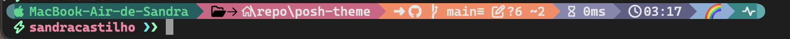

# poshterm

> A custom Oh My Posh theme for my terminal, inspired by the montys theme, and powered by emojis.

Config Version: 3

---

## Preview

---

## Available Segments

| Segment         | Description (if known)                                        |
|-----------------|---------------------------------------------------------------|
| ssh             | SSH session indicator (the remote needs oh-my-posh configured)|
| os              | Operating system info  and hostname                           |
| path            | Current working directory                                     |
| git             | Git branch/status                                             |
| node            | Node.js version                                               |
| python          | Python version/virtualenv                                     |
| executiontime   | Command execution time                                        |
| time            | Current time (hour:min)                                       |
| time            | A different emoji every day of the month                      |
| exit/status     | Last command exit status                                      |
| text            | Username indicator                                            |
| root            | Root/admin indicator                                          |

---

## Usage

See the [oh-my-posh website](https://ohmyposh.dev/docs/installation/customize).

---

## Credits

Inspired by the [montys](https://github.com/JanDeDobbeleer/oh-my-posh/blob/main/themes/montys.omp.json) theme.

---
